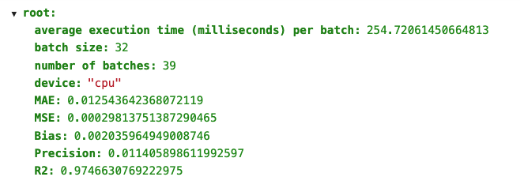
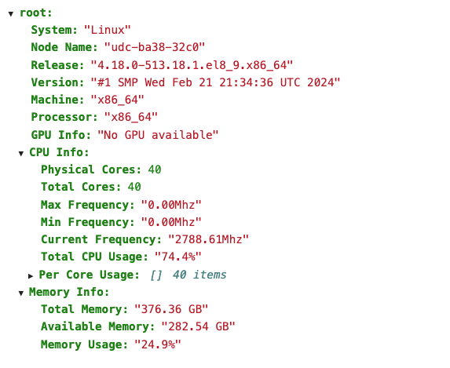
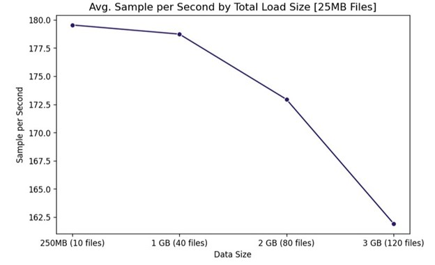
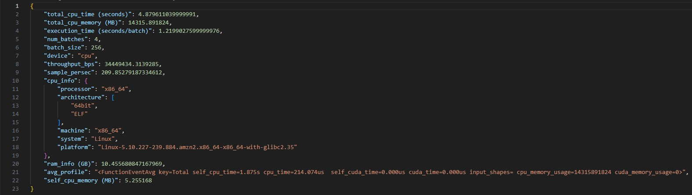
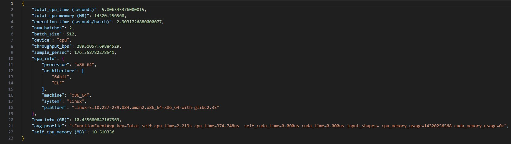
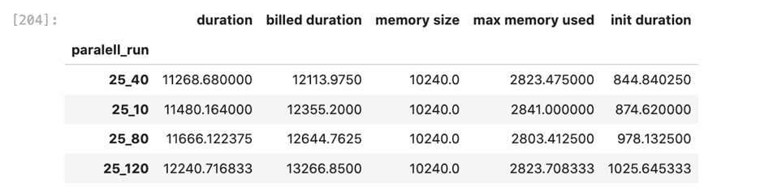
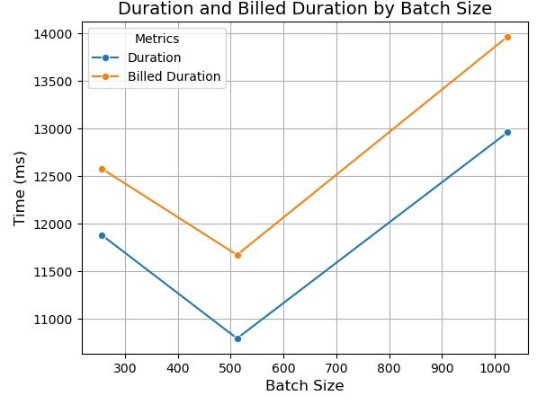
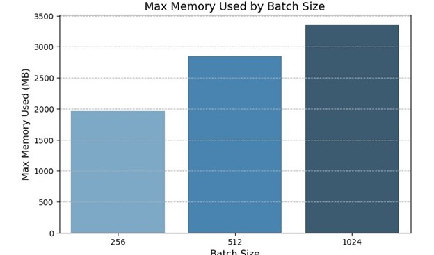

<h2 align="center">
  <strong>Big Data Systems - Fall 2024: Team 1</strong>
</h2>

<h3 align="center">
  <strong>Members</strong>
</h3>

<p align="center">
  <strong>George Shoriz</strong><br>
  <strong>Harold Haugen</strong><br>
  <strong>Dan Anthony</strong><br>
  <strong>Zack Lisman</strong>
</p>

---

## Table of Contents
- [Introduction](#introduction)
- [Problem Statement](#problem-statement)
- [Data Details](#data-details)
- [Experiment Process](#experiment-process)
  - [Data Pre-Processing](#data-pre-processing)
  - [Model Training](#model-training)
  - [Step Function Execution](#step-function-execution)
  - [Evaluation Metrics](#evaluation-metrics)
- [Beyond the Original Specifications](#beyond-the-original-specifications)
  - [Step Function Specifications](#step-function-specifications)
  - [Cosmic AI Specifications](#cosmic-ai-specifications)
- [Results](#results)
  - [Step Function](#Step-Function)
  - [Cosmic AI](#Cosmic-AI)
  - [Insights and Use Case Recommendations](#insights-and-use-case-recommendations)
- [How to Set the Project Environment and Replicate Results](#how-to-set-the-project-environment-and-replicate-results)
  - [1. Using AWS SageMaker](#1-using-aws-sagemaker)
  - [2. Setting Up AWS S3](#2-setting-up-aws-s3)
  - [3. Download the Project Files](#3-download-the-project-files)
  - [4. Setting Up AWS Lambda Functions](#4-setting-up-aws-lambda-functions)
  - [5. Creating and Running AWS Step Functions](#5-creating-and-running-aws-step-functions)
    - [Overview of the Input Payload](#overview-of-the-input-payload)
    - [File Organization for Step Functions](#file-organization-for-step-functions)
    - [Setting Up the Step Function](#setting-up-the-step-function)
    - [Executing the State Machine](#executing-the-state-machine)
    - [Viewing Execution Logs](#viewing-execution-logs)
- [Conclusion](#conclusion)
  - [Step Fucntion Conclusion](#step-function-conclusion)
  - [Cosmic-AI Conclusion](#cosmic-ai-conclusion)

---

## Introduction

This project focuses on creating scalable and efficient data processing pipelines using the AWS Step Function with Lambda. Our objective is to investigate and implement critical data processing techniques on a model training problem that includes ensuring the system is optimized for both performance and cost-efficiency. Under typical data pipeline approaches, this process would include data cleaning, outlier removal, and other pre-processing steps. By leveraging parallel Lambda executions and varying workload parameters (like world_size), the project sought to improve scalability and resource utilization. 

We aim to gain a better grasp of AWS capabilities and how to use them to optimize operations while keeping costs low and efficiency high. Our goal is to create a functional pipeline that will increase our ability to manage massive datasets, automate operations, and deploy machine learning models effectively.

---

## Problem Statement

The goal of this project is to design and implement a scalable data processing and machine learning pipeline using AWS tools to explore insights from an astronomical dataset. The project requires end-to-end processing of the dataset, starting with data pre-processing, cleaning, and outlier removal to ensure high-quality inputs for analysis. The cleaned dataset is then saved and processed through an executed python-program that performs inference using a machine learning model.

The problem we aim to address involves efficiently handling large-scale astronomical data while maintaining cost and time efficiency. This includes leveraging AWS services like SageMaker for development and reporting, S3 for data storage, Step Functions for workflow orchestration, Lambda for scalable computing, and CloudWatch for monitoring and debugging.

By addressing this issue, the initiative hopes to achieve the following:

  - Automate and scale data pre-processing tasks using AWS services.
  - Efficiently train or fine-tune a machine learning model for redshift prediction from astronomical images and associated metadata.
  - Present results in a clear and insightful manner through tables and visualizations.
  - Identify and optimize resource utilization to ensure the solution is cost-effective and adaptable to real-world scenarios.

The significance of this project goes beyond its technological execution and predictive outputs, since the insights gained from the data structure and the techniques utilized may be applied to other large-scale datasets in fields such as astronomy, healthcare, and others. This project offers a hands-on chance to investigate the challenges and rewards of developing strong, scalable pipelines for processing and analyzing complicated data.

---

## Data Details

The model that is used for redshift prediction is pre-trained as "a vision transformer encoder on Sloan Digital Sky Survey (SDSS) images to capture general patterns" and is then fine-tuned "with a specialized architecture for redshift prediction." This approach leverages the power of transfer learning, where the model first learns generalizable features from a vast collection of SDSS images and then adapts to the specific task of predicting redshift. This fine-tuning step enables the model to focus on intricate patterns and relationships within the dataset, such as the correlation between photometric magnitudes and redshift.

The SDSS dataset includes images with "corresponding magnitude values for the five photometric bands (u, g, r, i, z) and redshift targets." Each image is meticulously processed to ensure compatibility with the model's requirements, including cropping from 64 x 64 pixels to 32 x 32 pixels for input optimization. The magnitude values represent measurements of brightness across different wavelengths, which, combined with the image data, provide a rich and multi-dimensional view of celestial objects. This combination of image and numerical data ensures a comprehensive approach to redshift prediction, enhancing the model's ability to generalize across diverse astronomical objects.

The use of a vision transformer model is particularly significant for this task, as it excels in capturing spatial and contextual relationships in image data, making it well-suited for the analysis of celestial phenomena. By integrating both visual and numerical modalities, this methodology represents a cutting-edge approach in astrophysics, showcasing the potential of machine learning in advancing our understanding of the universe.

---

## Experiment Process

### Data Pre-Processing
The design process begins with a dataset like AI-for-Astronomy. The dataset will be cleaned, with missing values handled and outliers detected to assure quality. The cleaned data is then saved as a CSV file and transferred to an S3 bucket for further processing. In support of parallel distribution within the AWS Step Function, source data is broken up into different directory folders by size configuration within S3 (e.g., 10MB, 25MB, etc.). This allows our team to run inference executions under varying data workload and batch sizes for performance investigation. 

### Model Training
We next create a *Step Function* that calls an *AWS Lambda* function to execute data processing operations like data loading and machine learning model training. Once the model has completed its run, the results are recorded and shown in tables and visualizations for easy interpretation. Throughout the process, testing and validation are carried out to ensure the outputs' dependability and correctness.

### Step Function Execution 
Parameters associated with execution pipeline may be altered within the Lambda Payload of the AWS Step Function, including Batch Size, World Size and directory paths across S3 bucket locations. Our team investigated changes across these various parameters and observed their impacts to execution performance and stability.  

### Evaluation Metrics
Descriptions of the primary metrics used during the evaluation including redshift model prediction and AWS Step Function performance are noted below: 
- **Mean Absolute Error (MAE)**: Measures the average magnitude of the errors between predicted and true values, providing insight into prediction accuracy.
- **Mean Square Error (MSE)**: Quantifies the average of squared errors, emphasizing larger deviations to highlight significant prediction errors.
- **Bias**: Measures the average residuals between predicted and true values, indicating any systematic over- or underestimation in predictions.
- **Precision**: Represents the expected scatter of errors, reflecting the consistency of the model's predictions.
- **R² Score**: Evaluates how well the model predicts compared to the mean of true values; a value closer to 1 indicates better predictive performance.
- **Execution Time (seconds/batch)**: Measured the time taken to process a batch of data.
- **Billed Duration (seconds)**: Reflected the total time billed for processing a batch. 
- **Max Memory Used (MB)**: Indicated peak memory usage during processing.
- **Sample Throughput (samples/second)**: Captured the number of samples processed per second. 
- **Total CPU Time (seconds)**: Quantified the overall CPU time consumed during batch processing. 

---

## Beyond the Original Specifications

### Step Function Specifications

We went beyond the project's initial scope by experimenting with different `world_size` parameters in the AWS Step Function with Lambda process. This allowed us to observe how changing the number of parallel processes affected both performance and cost efficiency. 

Testing alternative `world_size` parameters helped determine the best configuration for our dataset, resulting in improved scalability and resource utilization. We worked in the AWS CloudWatch reporting module to understand how output log files are structured and accessed. Using a team developed exploratory Jupyter-Notebook, we were able to ingest CloudWatch Log exports then isolate our teams executed Lambda Functions to capture performance metrics for reporting and review. Additionally, we leveraged a eam group chat for regular communication to coordinate our tasks, share insights, and manage project tasks. 

### Cosmic AI Specifications
The primary specification asked for the successful execution of the Cosmic AI Inference model within an AWS Step Function and to evidence our team's ability to capture and assess performance metrics for scalability.  

 As a step beyond this requirement, our team: 

 - 1. Designed and implemented our own AWS State Machine and S3 bucket environments. This allowed for separate Step Function execution and tracking, as well as separate bucket configuration for source data, Python files, and output capture.  

 - 2. Modification of the ‘inference.py’ model file to alter the Batch Size parameter for performance investigation and review. This entailed saving several versions of the model with each representing a different batch size update. 

 - 3. Modification of the World_Size parameter set in the Lambda Payload, as well as other key payload inputs to assess performance impact and stability.  

 - 4. Execution of the primary inference model using parallel distribution based on S3 data separation. This involved using the ‘DataParallel-CosmicAI’ Step Function but altering the Lambda Payload json code to connect the execution to our team’s ‘team-one-cosmic-data’ S3 Bucket for data sourcing, model .py files and reporting directories. We modified the World_Size parameter within the Lambda Payload code to adjust for the number of files to process, which allowed us to investigate performance impact associated with data size, while placing the data through a distributed processing design.  

 - 5. Development of exploratory Jupyter-Notebooks to a) consolidate performance json file outputs that were designed and saved down by the inference model code and b) to assist with the isolation and reporting of our team’s Step Function executions based on saved CloudWatch log .csv records.  

 - 6. Visualization of performance metrics using Seaborn/Python code.  

---

## Results

### Step Function [Mid-Project Execution]

The following results were captured from our initial run of the inference model on AWS, without parallel distribution of the data.

| World Size | Lambda Init Duration (sec) | MapState Duration (sec) | Step Function Duration (sec) |
|------------|----------------------------|-------------------------|------------------------------|
| 2          | 0.373                      | 2.609                   | 3.161                        |
| 10         | 0.199                      | 3.203                   | 3.554                        |
| 24         | 0.476                      | 5.040                   | 5.682                        |

Experimenting with different `world_size` values in *AWS Step Functions with Lambda* revealed that increasing parallelism helps scalability but provides diminishing returns in performance beyond a certain point. Execution times varied, with lower `world_size` combinations being more cost-effective and time-efficient. Memory utilization was constant across workloads, allowing for better resource allocation.





#### Performance Monitoring 

Upon monitoring for successful completion (see workflow graph), we reviewed execution metrics captured in the CloudWatch Logs, under the FMI_Executor log group (via Python filters). The following table outlines results for Rank 0 and 1 nodes.  


### Cosmic AI

The Cosmic AI section represents execution of the inference model using our team’s ‘Cosmic_AI_Team_One’ Step Function/State Machine and ‘team-one-s3-cosmic’ S3 bucket. This section also captures our performance of parallel distribution using the ‘DataParallel-CosmicAI’ Step Function and our team’s ‘team-one-cosmic-data’ S3 bucket.  

The following results showcase performance from execution of the ‘Inference’ model itself, as well as execution of the entire AWS Step Function from end-to-end.  

**Inference Results – CPU Execution**

| Batch Size | Total Batches | Total CPU Run Time (sec) | Total CPU Memory (Mb) | Execution Time (sec) | Sample Size per Second |
|------------|---------------|--------------------------|-----------------------|-----------------------|-----------------------|
| 256        | 4             | 4.88                     | 14315.89              | 1.22                  | 209.85                |
| 512        | 2             | 5.81                     | 14320.20              | 2.90                  | 176.36                |
| 1024       | 1             | 7.41                     | 14330.32              | 7.46                  | 137.25                |

#### Graph: Avg. Execution Time by Total Load Size


#### Graph: Avg. Sample per Second by Total Load Size


#### JSON Data Sources for Inference Results
The following JSON files provide the raw data used to calculate the results in the table above:

- **Cosmic JSON for Batch Size 256**  
  

- **Cosmic JSON for Batch Size 512**  
  

- **Cosmic JSON for Batch Size 1024**  
  


- **Batch Size 256**:  
  Batch size 256 offers the fastest execution time per batch (**1.22 seconds**) and the highest sample size per second (**209.85**). It is highly efficient for time-sensitive tasks. However, its total CPU memory usage (**14,315.89 MB**) is similar to larger batch sizes, which could lead to higher costs.

- **Batch Size 512**:  
  This batch size provides a good balance between speed and resource utilization. Its execution time (**2.90 seconds**) and sample size per second (**176.36**) are reasonable. Additionally, its total CPU memory usage (**14,320.20 MB**) is nearly the same as batch size 256, indicating diminishing returns in memory efficiency.

- **Batch Size 1024**:  
  While batch size 1024 processes the samples in a single batch, it suffers from the slowest execution time per batch (**7.46 seconds**) and the lowest sample size per second (**137.25**). Its higher total memory usage (**14,330.32 MB**) makes it less suitable for both time-sensitive and cost-efficient applications.

**Inference Results – Parallel Distribution**


---

**Cloud Watch**

Performance of the end-to-end AWS Step Function execution: 

#### CloudWatch Results Table


#### Graph: Duration and Billed Duration by Batch Size


#### Graph: Max Memory Used by Batch Size


- **Batch Size 256**:  
  Although batch size 256 has the highest full duration (**11.88 seconds**) and billed duration (**12.58 seconds**), it uses the least max memory (**1960 MB**) compared to the other batch sizes. This makes it memory-efficient but potentially costlier due to longer durations.

- **Batch Size 512**:  
  Batch size 512 demonstrates the best overall balance. Its billed duration (**11.67 seconds**) is close to batch size 256, but its max memory usage (**645 MB**) is substantially lower, making it the most cost-efficient option.

- **Batch Size 1024**:  
  Batch size 1024 is the least efficient of the three. It uses the most max memory (**3350 MB**) and has the highest billed duration (**13.97 seconds**). While it can handle large batches, it is costly and slow, making it unsuitable for most use cases.

---

### **Insights and Use Case Recommendations**

#### **1. Strength and Weaknesses:**

 **Batch Size 256**
- ***Strengths***: Achieves the fastest execution time per batch (**1.22 seconds**) and the highest sample size processed per second (**209.85**). These metrics make it ideal for time-sensitive applications where rapid processing is crucial.
- ***Weaknesses***: Despite its speed, it has the highest billed duration (**12.58 seconds**) and memory usage (**14,315.89 MB**) similar to larger batch sizes, which could inflate costs over time.

 **Batch Size 512**
- ***Strengths***: Strikes the best balance between cost and performance. It demonstrates a reasonable execution time (**2.90 seconds**) and the second-highest sample size processed per second (**176.36**) while utilizing significantly less memory (**14,320.20 MB** in total CPU memory, **645 MB** max memory). Its billed duration (**11.67 seconds**) is close to that of batch size 256, offering cost efficiency.
- ***Weaknesses***: While it balances speed and memory usage effectively, it is slower than batch size 256, making it less ideal for applications requiring the fastest possible processing.

 **Batch Size 1024**
- ***Strengths***: Processes the largest number of samples in a single batch, which could be beneficial for workloads involving extremely large datasets or batch-dependent operations.
- ***Weaknesses***: Suffers from the slowest execution time per batch (**7.46 seconds**) and the lowest sample size processed per second (**137.25**). It also incurs the highest memory usage (**14,330.32 MB total CPU memory, 3,350 MB max memory**) and the longest billed duration (**13.97 seconds**), making it the least efficient and most costly of the three.

#### **2. Best Batch Size for Cost-Effectiveness**
Batch size **512** strikes the ideal balance between speed, memory usage, and cost. With the lowest max memory usage (**645 MB**) and reasonable execution time (**2.90 seconds**), it minimizes costs associated with both memory usage and billed duration.

#### **3. Best Batch Size for Speed**
Batch size **256** is the fastest, achieving an execution time of **1.22 seconds** and the highest sample size per second (**209.85**). It is ideal for applications where speed is a top priority, though memory costs are slightly higher.

#### **4. Worst Batch Size**
Batch size **1024** performs poorly in almost every category. Its slow execution time (**7.46 seconds**), high memory usage (**3350 MB**), and extended billed duration (**13.97 seconds**) make it unsuitable for most practical applications.

#### **5. Trade-Offs**
- Batch size **256** is optimal for speed but incurs higher billed durations and similar memory usage to batch size 512.  
- Batch size **512** achieves the best balance overall, reducing memory usage significantly without a substantial increase in billed duration or execution time.

---
### **Correlations Between Inference and Step Function Execution**
Observations between execution of the model (based on coded metric reporting) and the entire workflow as capture from the CloudWatch reporting logs.  

- **Memory Usage**: Total CPU memory in inference results remains nearly constant across batch sizes, while max memory usage in Cloud Watch data varies significantly. Batch size **512** stands out with the lowest memory requirement.
- **Execution Time and Billed Duration**: Longer execution times directly correlate with higher billed durations, as seen in batch size **1024**, which has the highest values for both metrics.

---

### **Recommendations for Use Case**
- For **quick processing tasks**, batch size **256** is recommended to prioritize speed.
- For **cost-sensitive tasks**, batch size **512** is the most efficient due to its balance of speed, memory usage, and billed duration.
- Avoid batch size **1024** unless processing very large datasets where higher memory and execution times are acceptable trade-offs.
---

### **Key Takeaways**


- **Best Overall Choice**: Batch size **512** achieves the best balance, offering a reasonable trade-off between speed and memory usage while keeping costs manageable. It is recommended for most workloads where a combination of speed and cost-efficiency is critical.
- **Best for Speed**: Batch size **256** excels in speed and throughput, making it the preferred choice for real-time or low-latency applications. However, its higher memory usage and longer billed duration may increase operational costs.
- **Worst Choice**: Batch size **1024** underperforms across almost all metrics, with slower execution times, lower throughput, and significantly higher memory usage. It is best avoided unless the workload specifically benefits from processing large batches.

---

## How to Set the Project Environment and Replicate Results

This section provides a detailed tutorial for setting up the project environment and replicating the results. Follow the steps below to ensure proper configuration and execution.

### 1. Using AWS SageMaker
  1. Download the two files `Setup_Dependencies.ipynb` and `Update_IAM_Roles_And_Policies.ipynb` inside `How to Set the Project Environment and Replicate Results`
  2. Run the `Setup_Dependencies.ipynb` notebook to install all necessary dependencies and configure the environment.
  3. Use the `Update_IAM_Roles_And_Policies.ipynb` notebook to configure the necessary IAM roles and policies.

### 2. Setting Up AWS S3
  1. Navigate to the S3 service in your AWS Management Console.
  2. Create a new bucket that will host your Python scripts and store results.
  3. Inside the bucket:
   - Create a folder named `scripts`.
   - Create another folder named `result`.

### 3. Download the Project Files
  1. **Download the required files**:
   Navigate to the `How to Set the Project Environment and Replicate Results` folder in this repository and download the folders **'aws'**, **'code'**, and **'data'** this includes all scripts for preprocessing, inference, and configuration.
  2. **Copy the Anomaly Detection folder**:
   Inside the downloaded files, locate the `Anomaly Detection` folder under `code` and upload it to the `scripts` folder in your S3 bucket.

### 4. Setting Up AWS Lambda Functions
  1. Navigate to the AWS Lambda service in your AWS Management Console.
  2. Create a Lambda function for executing the fmi_executor payloads.
  3. Configure the Lambda function to process the scripts uploaded to the `scripts` folder in your S3 bucket.

### 5. Creating and Running AWS Step Functions
To facilitate serverless inference for the Astronomy AI model, this project uses an AWS Step Function. The Step Function orchestrates multiple AWS Lambda functions and processes a payload to execute tasks. Follow the steps below to set up and execute the state machine.

#### Overview of the Input Payload
The state machine accepts an input payload in the following format:

```json
{
  "bucket": "cosmicai-data",
  "world_size": "2",
  "object_type": "folder",
  "S3_object_name": "scripts/Anomaly Detection",
  "data_path": "/tmp/scripts/Anomaly Detection/Inference/resized_inference.pt",
  "script": "/tmp/scripts/Anomaly Detection/Inference/inference.py"
}
```

**Description of Payload Parameters:**
- `bucket`: Name of the S3 bucket containing the required Python scripts.
- `world_size`: Number of Lambda functions to invoke in parallel.
- `object_type`: Specifies the type of object being processed (e.g., folder or file).
- `S3_object_name`: Path to the script in the S3 bucket.
- `data_path`: Path to the data file used for inference.
- `script`: The inference script’s path within the Lambda environment.

#### File Organization for Step Functions
The folder structure for Step Functions and related files is as follows:

```
aws/
├── lambda/
│   ├── initializer_FMI.py
│   ├── summarizer.py
│   ├── inference.py
│   ├── inference_FMI.py
│   └── initializer.py
├── split_data.py
├── stats.py
├── collect_lambda_logs.py
├── collect_logs.ipynb
├── compute_cost.py
├── demo input.json
├── plot_config.py
├── plots.ipynb
```

**Lambda Folder Files:**
- `initializer_FMI.py` and `initializer.py`: Initialize the data distribution and tasks for Lambda functions.
- `summarizer.py`: Aggregates and combines results into a unified output.
- `inference.py` and `inference_FMI.py`: Handle the inference tasks, including model execution and data processing.

#### Setting Up the Step Function
  1. Navigate to the AWS Step Functions service in the AWS Management Console.
  2. Create a new state machine named `cosmicai`.
  3. Upload and configure the Lambda functions (from the `lambda` folder) to the state machine.
  4. Edit the input payload for the state machine as follows:

```json
{
  "bucket": "<your-s3-bucket-name>",
  "world_size": "2",
  "object_type": "folder",
  "S3_object_name": "scripts/Anomaly Detection",
  "data_path": "/tmp/scripts/Anomaly Detection/Inference/resized_inference.pt",
  "script": "/tmp/scripts/Anomaly Detection/Inference/inference.py"
}
```

  5. Update the payload fields to match your S3 bucket and file paths.
  6. Save the state machine configuration and ensure all necessary resources (Lambda, S3) are properly linked.

#### Executing the State Machine
  1. Select the `cosmicai` state machine in the Step Functions console.
  2. Click the Execute button to run the state machine with the configured input payload.
  3. Monitor the execution to verify the results and troubleshoot if needed.

#### Viewing Execution Logs
Navigate to the AWS CloudWatch service in the AWS Management Console.
View execution logs under the log group:
- `/aws/lambda/cosmic-executor`

Use the provided script (`collect_lambda_logs.py`) to automate the retrieval of logs.

---

## Conclusion

### Step Function Conclusion

Our findings showed that altering the `world_size` parameter has a considerable influence on both execution time and costs. For example, when we set the `world_size` to 2, the Step Function time was 3.1 seconds, but raising the `world_size` to 24 resulted in a duration of more than 5.6 seconds, even though more parallel processing was occurring. This shows that, after a certain point, increased parallelism creates overhead, resulting in inefficiencies rather than speed advantages.

These insights may be useful to anyone looking to optimize *AWS Step Functions with Lambda* for similar operations, as knowing this balance is critical for improving both performance and cost-efficiency.

To improve the program, we would investigate methods to decrease the cost of larger `world_size` setups, such as improving Lambda function coordination or dynamically allocating resources.

### Cosmic AI Conclusion

The **Cosmic AI** analysis underscores the trade-offs between performance and cost-efficiency across batch sizes 256, 512, and 1024. Based on the results, **batch size 512** is recommended for most workloads due to its optimal balance of speed, memory usage, and cost-efficiency. It achieves a moderate execution time (**2.90 seconds**) and the lowest memory usage (**645 MB max memory**) while maintaining a billed duration (**11.67 seconds**) close to the fastest batch size, 256. These attributes make batch size 512 a versatile choice for a wide range of tasks, especially when cost and performance need to be balanced.

**Batch size 256**, on the other hand, is the fastest option, with an execution time of just **1.22 seconds** and the highest sample throughput (**209.85 samples per second**, as shown in the graph *"Avg. Sample per Second by Total Load Size"*). This makes it ideal for time-sensitive applications or scenarios where low latency is critical. However, its higher billed duration (**12.58 seconds**) and memory usage (**1960 MB max memory**) can lead to increased costs in long-running workloads, reducing its cost-effectiveness compared to batch size 512.

**Batch size 1024** demonstrates the highest inefficiencies, with the slowest execution time (**7.46 seconds**) and the lowest sample throughput (**137.25 samples per second**, as shown in the graph *"Avg. Sample per Second by Total Load Size"*). Additionally, it incurs the highest memory usage (**3,350 MB max memory**) and the longest billed duration (**13.97 seconds**, as shown in the graph *"Duration and Billed Duration by Batch Size"*), making it unsuitable for most practical applications. While it can process the largest number of samples per batch, this configuration's high resource demands and slow performance make it the least cost-efficient option.

These findings emphasize the importance of selecting the appropriate batch size based on workload requirements. Batch size **512** offers the best balance for most use cases, combining reasonable speed with efficient memory and cost management. Batch size **256** is suitable for real-time or low-latency tasks but comes with increased memory and billing overhead. Meanwhile, batch size **1024** should be avoided unless specific tasks demand processing very large batches where resource and cost trade-offs are acceptable.

---