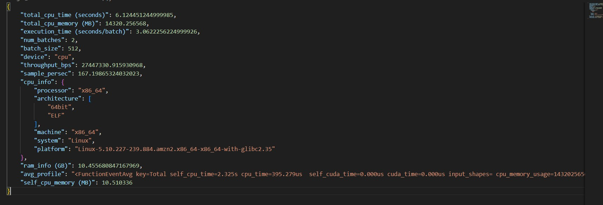

# BigDataSystems-Fall 2024: Team 3 

## Members: 

Kanitta, Karthika, Chi, Aqsa

## Introduction: 

Our project involves enhancing an existing AWS Step Function that runs FMI Lambda functions, focusing on creating a scalable, budget-friendly system. Through this work, we aim to deepen our knowledge of FMI functions, AWS services, and approaches to system and data parallelization. Ultimately, we plan to apply these insights to develop a practical, data-driven application. For practical insights, we are using AstroMAE, a new system for predicting redshift, which is how astronomers measure the distance and speed of galaxies as the universe expands. AstroMAE uses advanced machine learning techniques, such as masked encoders, to analyze images from space, making predictions more accurate than older methods. This part of the project shows how we can apply cutting-edge tools to solve real-world problems in astronomy.   

## The Data:

There will be two stages for this project. The first will be benchmarking the Step Functions without any data present. The second will use astronomy data to test the Step Function
The dataset we are using is Sloan Digital Sky Survey (SDSS), a prominent astronomical survey. It contains 1,253 images of celestial objects. Each image includes magnitudes in five color bands (u, g, r, i, z) and redshift targets information. The original images were at a resolution of 64x64 pixels then the images were cropped to 32x32 pixels. For the initial lambda function, we used a portion of the total data available, so  our first trials would not require parallelization. 
The data was stored in a structural format, with images organized as arrays (32 x 32 pixels) and corresponding metadata, such as magnitude values and redshift targets, which are most likelyd stored in tabular formatting like CSV, Pandas DataFrame.  
According to the GitHub, The data for the AstroMAE project was carefully prepared to ensure it was ready for training. First, the 64 × 64-pixel images were cropped to 32 × 32 pixels to fit the model's requirements. Data cleaning was done to make sure all images and their related information were correctly matched and consistent. The pixel values and magnitude data were normalized so everything was on the same scale. Corrupted or invalid data, like missing values or extreme redshift targets, were removed to improve the model's performance. Lastly, the data was divided into training, validation, and test sets to check how well the model works. These steps ensured the data was high-quality and ready to train AstroMAE. 

## Experimental Design:

Within the prebuilt State Machine on AWS, we set up the Step Function that will later be used to run Lambda functions. This Step Function can have changes in payloads and the number of parallel Lambda functions they run. We ran 3 experiments to 3 payloads, invoking 2, 4, 16 parallel lambdas.  

Beyond the original specifications: 

In addition to the Step Function experiment, the team also created a GitHub project where all tasks are stored. Each task has a member assigned and is moved through the to do list.  

## Results: 

We ran 3 experiments to 3 payloads, invoking 2, 4, 16 parallel lambdas. These were then benchmarked for time and cost. These are presented in overalls below. 

Below are the time benchmarking for the lambda function with no data is below. 

| Number of Lambda invoked | Execution time(seconds) |
|--------------------------|:-----------------------:|
| 2                        |          4.720          |
| 4                        |          7.566          |
| 16                       |          5.158          |

The cost benchmarking for the lambda function with no data is noted. 

| Item                         | Cost (USD) |
|------------------------------|------------|
| Elastic Container Service    | 2.04       |
| CloudWatch                   | 0.24       |
| Key Management Service       | 0.03       |
| Simple Storage Service       | 0.03       |
| EC2 Container Registry (ECR) | 0.02       |
| Secrets Manager              | 0.01       |
| Total                        | 2.37       |

The performance benchmarking revealed that the CPU achieved its best time at a world size of 3 with 11.224 ms, though timings fluctuated for larger sizes due to resource contention. On the GPU, the best performance was observed at a world size of 32 with 12.251 ms, but processing times increased as world sizes grew, reaching 49.760 ms at a world size of 200. 

Regarding costs, AWS Step Functions incurred a minimal charge of $0.00015 USD for 3 executions with 2 state transitions each. AWS Lambda added $0.00260352 USD, combining request and duration costs for 15.6 seconds of execution with a 10 GB memory allocation. The total execution cost for 3 runs was $0.00275352 USD, demonstrating the system's cost efficiency alongside its scalability. 

## Testing: 

The team went through the AWS set up of the Step Function. Once set up was complete, we changed the world size several times, and tracked the time. Results are presented above. Overall costs were taken. 

## Conclusions: 

Overall, the cost of running a Lambda function on AWS is very small, but it's not nothing. It will be interesting to see how costs and time change with the addition of data. 

The results show that CPUs perform better for smaller tasks, while GPUs are more efficient for handling larger tasks, though the time cost increases as the workload grows. This information helps others decide when to use CPUs for lighter tasks and GPUs for more computationally intensive ones. 

To improve the system, we could add a feature that automatically switches between CPUs and GPUs depending on the task size. We could also use GPUs more effectively by running tasks in parallel to speed up large jobs. Adding automatic scaling would help balance costs and performance. Lastly, improving how data is handled would make processing faster on both CPUs and GPUs, making the system more efficient for different tasks.  

## How to set the project environment and replicate the results

The initial Lambda function with no data was run according to the Step Function Tutorial (Semester Project) listed in the Pre-Class Assignment on Canvas. 

For the additions with data, references such as the [FMI wiki Overview](https://github.com/mstaylor/fmi/wiki/Aws) were used. The State Machine was copied and named as Group3_CosmicAI. All world size and GPU vs CPU tests were run here. When running, the "Concurrency limit" in the "Distributed Test" block was set to 20 for world sizes larger than or equal to 32.    

Data was stored in a an S3 bucket called team3cosmicai. Data files and the inference.py files were stored here. Changes to this file include using 'cuda' as the default so GPU will be used.  

## Cosmic AI Results

Summary:

1. **Total CPU Time (s)**: The total time taken by the CPU to complete the operation is approximately 6.124 seconds. This metric indicates the overall CPU usage duration for the task.

2. **Total CPU Memory (MB)**: The total memory utilized by the CPU is 14320.256 MB (approximately 14 GB). This is a significant amount of memory, which suggests that the operation is memory-intensive.

3. **Execution Time per Batch (s)**: Each batch takes around 3.062 seconds to execute. With 2 batches in total, this gives an idea of how long each segment of the workload takes to process.

4. **Number of Batches**: The workload is divided into 2 batches, indicating that the processing was split into smaller chunks for efficiency or memory management.

5. **Batch Size**: Each batch contains 512 units, which could refer to the number of data samples or processing elements in each batch.

6. **Throughput (Bps)**: The throughput is approximately 27,473,330 bytes per second, which measures the amount of data processed per second.

7. **Samples per Second**: The system processed around 167.198 samples per second, indicating the speed at which individual data samples were handled.

8. **RAM Info (GB)**: The available system RAM is approximately 10.456 GB. This provides context about the total memory capacity of the system.

9. **Self CPU Memory (MB)**: The memory specifically used by the CPU for this operation is 10.510 MB, which is a relatively small portion compared to the total memory used.

