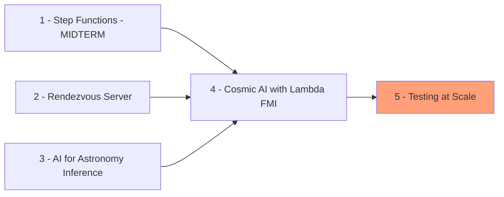

# Team 4 Semester Project

<a href="https://github.com/psf/black/blob/main/LICENSE"></a>
<a href="https://github.com/psf/black"></a>

The Semester Project is to build and test the POC infrastructure needed to cheaply and efficiently run the AI-for-Astronomy
Inference Model.

Development done locally on a Mac and at scale with Linux on our [class AWS Account](https://us-east-1.console.aws.amazon.com/console/home?region=us-east-1#)

>[!NOTE]
>Access to this Account might not be active after the Fall 2024 Semester is over.

## Progress

Currently we are exploring <span style="color: #FFA07A;">Scaling</span>



## Repo structure

```bash
├── AI-for-Astronomy # model we explore (run git pull)
├── README.md
├── data # local data (.gitignore)
├── demos # notebooks to show off
├── docs # deeper understanding
├── experiments # ideas
├── img 
├── keys # .pem files to access class account (not saved)
├── makefile # build 
├── scratch # to be deleted (.gitignore)
├── scripts # to be run
├── src 
└── tests # uses pytest see (test.md)
```

## Table of Contents

- [Team 4 Semester Project](#team-4-semester-project)
  - [Progress](#progress)
  - [Repo structure](#repo-structure)
  - [Table of Contents](#table-of-contents)
  - [Group Members](#group-members)
  - [Definitions](#definitions)
  - [1: Step Functions](#1-step-functions)
    - [`Introduction`](#introduction)
    - [Step Function Experimental Design](#step-function-experimental-design)
    - [`Beyond the original specifications`](#beyond-the-original-specifications)
    - [`Results`](#results)
      - [Time to Run for Different World Sizes](#time-to-run-for-different-world-sizes)
      - [Memory Costs](#memory-costs)
    - [Step 1: Conclusions](#step-1-conclusions)
  - [2 Rendezvous Server](#2-rendezvous-server)
    - [Steps Taken](#steps-taken)
  - [3: AI for Astronomy Inference](#3-ai-for-astronomy-inference)
    - [Setting the Device](#setting-the-device)
  - [4 Cosmic AI with Lambda FMI](#4-cosmic-ai-with-lambda-fmi)
  - [5 Parallel Execution](#5-parallel-execution)

## Group Members

| Name | Title |
|------|------|
|  Nicholas (Nick) Ray Miller    |  Data Scientist    |
|  Charles S Lotane    |  Data Scientist    |
|  Ryan Healy     |  Data Scientist    |

## Definitions

Below are some useful definitions related to the Projects Vocabulary.

To get a better sense of FMI consider reading the Wiki.
[FMI wiki Overview](https://github.com/mstaylor/fmi/wiki/Aws)

<dl>
  <dt>AWS Fargate</dt>
  <dd>a serverless compute engine that allows users to run containerized applications without having to manage the underlying infrastructure like servers or clusters</dd>

  <dt>Faas</dt>
  <dd>Functions as a Service, Serverless Computing in response to events</dd>

  <dt>FMI</dt>
  <dd>Faas Message Interface, a library for message passing and collective communication for serverless functions</dd>

  <dt>HPC</dt>
  <dd>High Performance Cluster, really meaning scaling beyond normal capabilities, think Afton or Rivanna </dd>
  
  <dt>Serverless Computing</dt>
  <dd>Cloud Computing provider (like AWS) handles the machine compute resources on demand</dd>

  <dt>World Size</dt>
  <dd>Number of Lambda Functions to invoke note: in order of 2s[2,4,6...n]</dd>

</dl>

Taken from the AWS Developer Guide - [here](https://docs.aws.amazon.com/step-functions/latest/dg/concepts-statemachines.html)

> **Step Functions** is based on state machines and tasks.
> a **series of event-driven steps**.
>
> Each step in a workflow is called a state.

## 1: Step Functions

<details>
<summary> Click to Explore Step 1 </summary>

This implementation is done with extensive help from Mils Taylor [and his video shown in class - requires a login - should be referenced.](https://canvas.its.virginia.edu/courses/121565/pages/week-5-chapter-5?module_item_id=1220355)

### `Introduction`

This initial part of the Big Data Systems Semester project, introduces Workflow Orchestration and the key part of any project which is optimizing the Budget.

The goal of the Semester Project is to develop a `Proof of Concept Model`. to do so requires being able to show and mimic the scale while being mindful of costs (large EC2 instances can be costly)

In addition to cost considerations, Lambda Functions can be scaled down to zero when there is zero work while EC2 compute instances need to be managed and shut down /manually destroyed.

While the AWS Lambda environment is highly constrained environment it [can cheaply mimic a HPC](https://arxiv.org/abs/2305.08763)

some of the infrastructure to run this experiment that is provided by the class include:

- a deployed Rendezvous sever deployed as `rendezvous.uva-ds5110.com`
- and a useable Registered Docker Image

These can be seen on the left side of the image below.

We can build the following part of an infrastructure.


>[!TIP]
 To run this locally you'll need the Docker Image, if building an Image from scratch or for a new application include make and Python 3.9+

 to get the Python library installed see below

```bash
# a needed dependency might be the fmi python library
# see the fmi github
git clone https://github.com/mstaylor/fmi
cd python
mkdir build
cd build
cmake ..
make
```

### Step Function Experimental Design

The State Machine took in several parts

including

1) an event (were manually started)
2) the number of Lambda functions to test (also known as worlds)
3) a script places on S3 (locally here scripts/fmi-test.py)
4) settings in a json format (scripts/fmi.json)

The DAG for the job is the following


### `Beyond the original specifications`

Multiple World sizes were tested in order to give us an idea of the appropriate scale needed.

### `Results`

#### Time to Run for Different World Sizes

| World Size | Run Time, sec |
|------|------|
| 2 | 4.846 |
| 4 | 4.635 |
| 20 | 5.029 |
| 50 | 6.877 |

#### Memory Costs

| Memory | Duration | Cost |
|------|------|------|
| 128 MB | 11.722 s | $0.024628 |
| 512 MB | 6.678 s | $0.028035 |
| 1024 MB | 3.194 s | $0.026830 |
| 1536 MB | 1.465 s | $0.024638 |

[Google Drive - copy of referenced logs, request access if needed](https://docs.google.com/spreadsheets/d/1bSQFHwop4_Ki_NDmygVB1IjslVpnG32vNwmEyj1rDBA/edit?gid=1467612570#gid=1467612570)

- an equivalent EC2 instance could be 3-5 dollars and has start up and tear down time and the potential to have unused compute running up a large bill
  
### Step 1: Conclusions

Using the FMI State Machines we've successfully deployed a cheap infrastructure to build our POC and simulate a real deployment.

Plus or minus some costs for startup costs and variability in cloud infrastructure start ups the provisioning of these systems is
$$T_n = \theta(log(n))$$

as can be seen in the graph below of World size (Lambda inputs) and Runtime in seconds


Which provides us with an easy and cheap way to scale.

>[!NOTE]
> Additional Notes
>
>- limited by the upper run time of an AWS Lambda Function (15 minutes)
>- limited to one script that has to be in an AWS S3 bucket
>- Output is sent to AWS Cloud Watch Log and should be examined using a log parser

compare different data sizes, and call sizes of the step functions

</details>

## 2 Rendezvous Server

<details>

<summary> Expand to learn more about the Rendevous Server </summary>

Taken from [preclass assignment](https://canvas.its.virginia.edu/courses/121565/assignments/571382?module_item_id=1318706)

The Faas Message Interface(FMI) uses the TCPunch

Links to an external site. communication library and Rendezvous server to establish socket communication between ($n$) AWS Lambda functions.
To run FMI Python scripts, it is necessary to deploy a Rendezvous Server on the public internet.

The `UVA DS5110` AWS account (TODO: link here) has includes a prebuilt Docker image that can be used.

### Steps Taken

1) go to AWS ECS (Elastic Container Service)
2) select `rendezvous-tcpunch-fargate-task from the list and select rendezvous-tcpunch-fargate-task:1`
3) Select the Deploy option, Select the fargate1 cluster and select the launch type as FARGATE.
4) Scroll down to the Networking section and choose the open access security group as the only security group associated with this task.
5) Select Create at the bottom of the page
6) After the Rendezvous server starts, you will need to extract the public ip address from the task. We will use that as the IP address for the A Route 53 record.
7) Navigate to the AWS Route 53 service, select the uva-ds5110.com hosted zone, and update the rendezvous.uva-ds5110.com record with the IP Address retrieved from the previous step.

</details>

## 3: AI for Astronomy Inference

<details>
<summary> Expand to learn more about the AI for Astronomy Inference</summary>

The input is run

The output is given here:

- `inference.png`: This contains a visual representation of the inference results.
- `Results.json`: This JSON file contains the detailed numerical results of the inference.

```json
# example of `Results.json` output
# TODO: replace with a valid run

{
    "total_cpu_time (seconds)": 5.814478928000014,
    "total_cpu_memory (MB)": 14320.256568,
    "execution_time (seconds/batch)": 2.907239464000007,
    "num_batches": 2,
    "batch_size": 512,
    "device": "cpu",
    "throughput_bps": 28910559.67036082,
    "sample_persec": 176.11208376194455,
    "cpu_info": {
        "processor": "x86_64",
        "architecture": [
            "64bit",
            "ELF"
        ],
        "machine": "x86_64",
        "system": "Linux",
        "platform": "Linux-5.10.227-239.884.amzn2.x86_64-x86_64-with-glibc2.35"
    },
    "ram_info (GB)": 10.455680847167969,
    "avg_profile": "<FunctionEventAvg key=Total self_cpu_time=2.229s cpu_time=375.273us  self_cuda_time=0.000us cuda_time=0.000us input_shapes= cpu_memory_usage=14320256568 cuda_memory_usage=0>",
    "self_cpu_memory (MB)": 10.510336
}

```

### Setting the Device

To run the script on either GPU or CPU, set the --device argument accordingly:

- For GPU: use `cuda`
- For CPU: use `cpu` (default)

To change the device, modify the --device argument as follows:

```python
    parser.add_argument('--device', type=str, default='cpu', help="Device to run the model on: 'cuda' for GPU or 'cpu' for CPU")
```

</details>

## 4 Cosmic AI with Lambda FMI

<details>
<summary>Expand to Learn More about Cosmic AI and the Lambda FMI</summary>

An AWS Step function has been developed to facilate orchestration of AI For Astronomy Serverless Inference. Step functions are represented as state machines and tasks. For the DS5110 class, the cosmicai state machine has been created. This step function takes an input payload and generates appropriate AWS Lambda fmi_executor payloads

In this payload we use world_size to represent the number of lambda functions to invoke, bucket to represent the S3 bucket that contains the fmi python script, S3_object_name to represent the path on the S3 bucket where the script can be found, data_path to represent where the resized_inference.pt can be founder, and script to represent the inference script.


```json
# payload

# double check permissions on bucket
# will time out after 15 minutes

{
  "bucket": "Group4-cosmicai", 
  "world_size": "1",
  "object_type": "folder",
  "S3_object_name": "scripts/Anomaly Detection",
  "data_path": "/tmp/scripts/Anomaly Detection/Inference/resized_inference.pt",
  "script": "/tmp/scripts/Anomaly Detection/Inference/inference.py"
}

```

To edit the input payload:

    Navigate to the AWS Step Function service
    Select the cosmicai state machine
    Select edit to edit the state machine
    Select the Lambda init state
    On the right, scroll to the payload section

Create an S3 bucket that will host your python script
Create result and scripts folders in this S3 Bucket
Clone the following repository: <https://github.com/mstaylor/AI-for-Astronomy.git>
Links to an external site. (i.e., git clone <https://github.com/mstaylor/AI-for-Astronomy.git>
Links to an external site.)
Copy the Anomaly Detection folder located under code to the S3 bucket
Execute the step function
You can view the execution logs by navigating to the following Cloudwatch Log Group: /aws/lambda/cosmic-executor
Results of the collective reduce operation are post to the S3 Bucket's result folder under 0 (rank zero)

<details>

## 5 Parallel Execution

Now that we have a Baseline its time to test at scale
